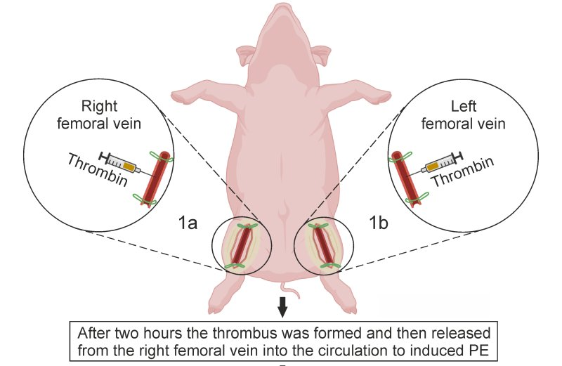

# VTE
This repository contains the scripts for the "venous thromboembolism and transcriptomic analysis of deep vein thrombosis in the femoral veins" project ([ENA: PRJEB43020](https://www.ebi.ac.uk/ena/browser/view/PRJEB43020)).

### Abstract 1
Venous thromboembolism (VTE), including deep vein thrombosis (DVT) and pulmonary embolism (PE), is a severe disease affecting the human venous system, accompanied by high morbidity and mortality rates. The aim of the study was to establish a new porcine VTE model based on the formation of the thrombus in vivo. The study was performed on 10 castrated male pigs: thrombus was formed in each closed femoral vein and then successfully released from the right femoral vein into the circulation of animals. In six pigs PE was confirmed via both computed tomography pulmonary angiography and an autopsy. Our research presents a novel experimental porcine model of VTE that involves inducing DVT and PE in the same animal in vivo, making it suitable for advanced clinical research and testing of future therapies.
* Gromadziński, L.; Skowrońska, A.; Holak, P.; Smoliński, M.; Lepiarczyk, E.; Żurada, A.; Majewski, M.K.; Skowroński, M.T.; Majewska, M. A New Experimental Porcine Model of Venous Thromboembolism. J. Clin. Med. 2021, 10, 1862. https://doi.org/10.3390/jcm10091862

